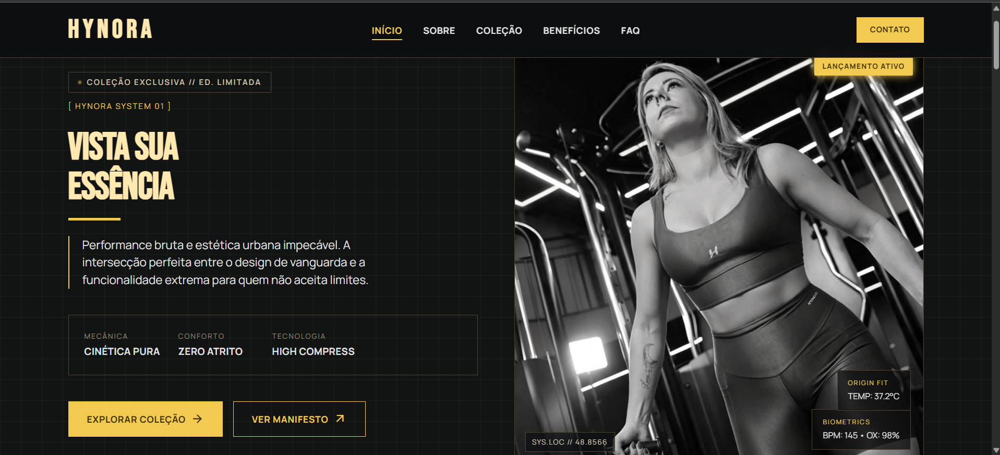

# HYNORA FITWEAR



Landing page de moda fitness e activewear com estética urbana minimalista. O projeto apresenta a identidade da HYNORA, suas coleções Origin feminina e masculina, benefícios dos produtos e uma seção de dúvidas frequentes.

## Funcionalidades

- Layout responsivo para desktop, tablet e mobile.
- Navegação fixa com menu mobile e indicação da seção ativa.
- Hero com apresentação da coleção HYNORA System 01.
- Seção manifesto com missão, valores, qualidade e performance.
- Coleções femininas e masculinas com filtros independentes por categoria.
- Cards de produtos com efeitos de hover.
- Faixas de destaque com animações sutis.
- Accordion interativo na seção FAQ.
- Botão flutuante para voltar ao topo.
- Atualização automática do ano no rodapé.

## Tecnologias

- HTML5 semântico
- CSS3 com variáveis, Grid, Flexbox, media queries e animações
- JavaScript nativo
- Google Fonts: Bebas Neue, Manrope, Playfair e Material Symbols

## Estrutura do projeto

```text
.
├── index.html
├── README.md
├── assets/
│   ├── css/
│   │   └── style.css
│   ├── images/
│   │   ├── aboutfoto.jpg
│   │   ├── favicon.jpg
│   │   ├── fitness.png
│   │   ├── homefoto.jpg
│   │   ├── post.png
│   │   └── preview.png
│   └── js/
│       └── script.js
```

## Observações

- As fontes são carregadas do Google Fonts, portanto precisam de conexão com a internet para serem exibidas conforme o design.
- As imagens dos produtos usam URLs externas de demonstração do `picsum.photos`.
- Os links de contato e detalhes de produtos ainda são destinos demonstrativos e podem ser conectados às páginas ou canais oficiais da marca.

## Publicação

O projeto pode ser publicado em serviços para sites estáticos, como Vercel, GitHub Pages ou Netlify, sem configuração adicional de build.

## Autoria

Desenvolvido por [Diego Francisco da Silva](https://diegofranciscodasilva.github.io/dev-software-web/).
